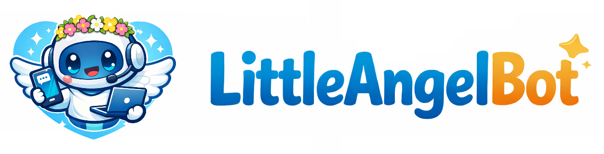

<div align="center">
  <h1>LittleAngelBot: A Personal Assistant Powered by Mobile QQ and Windows PC Collaboration</h1>
  <p>
    
    
  </p>
</div>

[中文 README](./README_zh.md)

A cross-platform personal assistant agent inspired by OpenClaw, designed for Windows PCs. It bridges mobile QQ and Windows capabilities so users can use natural language to plan and execute tasks end-to-end across devices.

LittleAngelBot can also be accessed via a CLI, and can be customized to integrate with platforms such as WhatsApp, Discord, Telegram, and more.

## GUI Preview

<div align="center">
  
</div>

## Timeline

- **2026-02-03** 🎉 LittleAngelBot is now open source.
- **2026-02-23** 🖥️ Added a graphical **Agent Console** (`angel_console/`) for unified operations:
  - Chat (SSE streaming + ReAct trace)
  - Voice input (browser recording + local transcription)
  - Search tasks (session retrieval and context navigation)
  - Channels (Web / CLI / QQ / Discord)
  - Scheduled tasks (Cron) and heartbeat
  - Skills management
  - Model configuration and switching
  - Model billing and call audit (token statistics)

## Core Highlights

- Cross-platform personal agent: mobile QQ ↔ Windows PC collaboration
- Multi-agent architecture: parallel decomposition and execution for complex tasks
- Intelligent routing: choose `ReAct` or `ReCAP` based on task complexity
- Context engineering: compression, unloading, and filesystem support to avoid context overflow
- Secure sandbox and async execution: more stable long-running task pipelines
- Skills integration: unified mechanism supporting customization and extension
- Task state management: supports long-chain, multi-turn task automation
- Stable execution strategy: plan first, then act
- Experience learning is being integrated: improves with usage

## Demo GIFs

<table align="center">
  <tr align="center">
    <th><p align="center">🔎 Information Gathering & Report Generation</p></th>
    <th><p align="center">⏰ Scheduled Tasks & Automation</p></th>
    <th><p align="center">🧩 Automatic Skills Creation</p></th>
    <th><p align="center">💻 Coding & Remote Execution</p></th>
  </tr>
  <tr>
    <td align="center"><p align="center"></p></td>
    <td align="center"><p align="center"></p></td>
    <td align="center"><p align="center"></p></td>
    <td align="center"><p align="center"></p></td>
  </tr>
</table>

## Capability Overview

- Information gathering and organization
- Report and document generation
- Scheduled tasks and automation
- Cross-device development and execution of coding tasks

## Graphical Agent Console

The project now includes a local graphical control plane in `angel_console/` to manage core agent capabilities in one place.  
By default, the console binds to `127.0.0.1` and is intended for local development and operations.

Main modules:

- Chat: session management, streaming responses, and tool trace visualization
- Voice Input: browser-side recording with local speech-to-text (Chinese and English)
- Search Tasks: cross-session retrieval with fast jump to relevant context
- Channels: unified channel configuration and status for Web / CLI / QQ / Discord
- Cron & Heartbeat: periodic jobs, manual triggers, and runtime status controls
- Skills: discover and manage available skills from the workspace
- Models: configure multiple providers/profiles and switch active runtime model
- Model Billing: inspect call volume, token usage, failure rate, and call-level details

## Use Cases

You can direct the agent anytime, anywhere (on the subway, while traveling, or on your bed):

- Fast collection and structured organization of work/study materials
- Automatic generation of reports, checklists, and summaries
- Multi-step tasks that require cross-device collaboration
- Personal development workflows and script-based automation

## Prerequisites

Environment variables:

- `LLM_API_KEY` (required, for model calls)
- `LLM_BASE_URL` (optional; defaults are chosen by `LLM_PROVIDER`)
- `LLM_MODEL` (optional; defaults are chosen by `LLM_PROVIDER`)
- `LLM_PROVIDER` (optional, `openai|anthropic|dashscope`; can be auto-detected)
- `BRAVE_API_KEY` (optional, for web search)
- `ZHIPU_API_KEY` (optional, for web search)
- `BOTPY_APPID` (required, for QQ entry)
- `BOTPY_SECRET` (required, for QQ entry)
- `LITTLE_ANGEL_AGENT_WORKSPACE` (optional, workspace path for the agent)

### Local Secrets File

Create `local_secrets.yaml` in the project root and fill in your keys:

```yaml
LLM_API_KEY: ""
LLM_BASE_URL: ""
LLM_MODEL: ""
LLM_PROVIDER: ""
ZHIPU_API_KEY: ""
BOTPY_APPID: ""
BOTPY_SECRET: ""
```

Note: Get the QQ bot `APPID` and `SECRET` by registering on Tencent QQ Open Platform and creating a bot: https://q.qq.com/#/

## Run

### CLI

```powershell
python entry_cli.py
```

### QQ Direct Message

```powershell
python entry_qq.py
```

## Project Structure

- `entry_qq.py`: QQ direct message entry
- `entry_cli.py`: CLI entry
- `little_angel_bot.py`: core bot logic
- `tools/`: tool capabilities
- `skills/`: Skills integration

## Development and Extension

- Add or modify skills in `skills/`
- Add new tool capabilities in `tools/`
- Customize behavior through the unified Skills mechanism

## License

MIT
