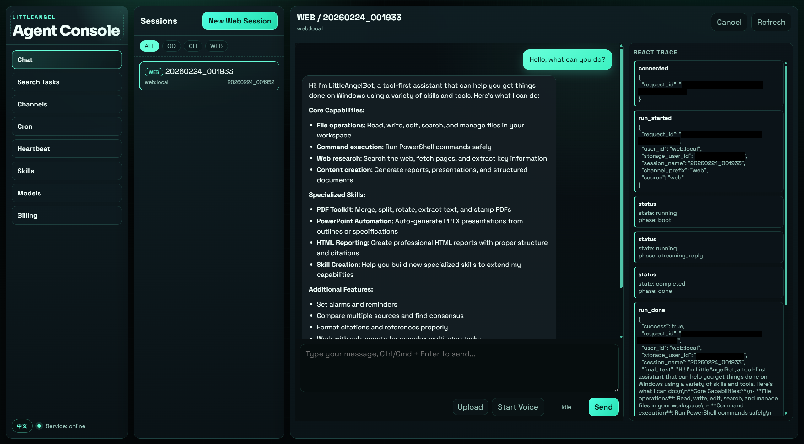

# LittleAngel Console v1

Web management console for LittleAngelBot.

## Timeline

- **2026-02-23**: `angel_console` first public usable version.
- **2026-02-23**: Added unified graphical Agent console modules: chat, voice input, search tasks, channels, cron, heartbeat, skills, model management, and model billing.

## Features

- Chat: session management across `qq:*`, `cli:*`, and `web:*`, plus SSE stream and ReAct trace.
- Voice Input: browser recording + local/offline speech-to-text (Chinese and English).
- Search Tasks: cross-session retrieval and context hit navigation.
- Channels: graphical configuration for `web`, `cli`, `qq`, and `discord`.
- Schedulers: built-in cron and heartbeat task management.
- Skills: workspace skill discovery and status display.
- Models: provider/profile configuration, activation, and connectivity checks.
- Model Billing: token-based usage statistics, failure metrics, and per-call audit details.
- Runtime Controls: AskHuman bridge, task cancellation, and file upload to `agent_workspace/uploads`.

## GUI Preview

<div align="center">
  
</div>

## Run

```powershell
cd d:\code\LittleAngelBot
.\.venv\Scripts\python.exe -m pip install -r requirements.txt
.\.venv\Scripts\python.exe angel_console\app.py
```

Service starts at `http://127.0.0.1:7788`.

## API

Base prefix: `/api/v1`

- `GET /health`
- `GET /sessions`
- `POST /sessions/new`
- `POST /sessions/select`
- `GET /sessions/messages`
- `POST /chat/stream` (SSE)
- `POST /chat/cancel`
- `POST /chat/human-input`
- `POST /files/upload`
- `GET /heartbeat`
- `PUT /heartbeat`
- `POST /heartbeat/run`
- `GET /cron/jobs`
- `POST /cron/jobs`
- `PUT /cron/jobs/{id}`
- `DELETE /cron/jobs/{id}`
- `POST /cron/jobs/{id}/pause`
- `POST /cron/jobs/{id}/resume`
- `POST /cron/jobs/{id}/run`
- `GET /skills`
- `GET /models/state`
- `POST /models/profiles`
- `POST /models/activate`
- `DELETE /models/profiles/{profile_id}`
- `POST /models/profiles/{profile_id}/test`
- `GET /billing/status`
- `GET /billing/overview`
- `GET /billing/calls`
- `GET /billing/calls/{call_id}`
- `GET /speech/status`
- `POST /speech/transcribe`

## Notes

- Default bind host is `127.0.0.1` only.
- New Web sessions are always created under `web:local`.
- Existing `qq/cli` sessions can be opened and continued in-place from the web console.
- Model profiles are persisted in `local_secrets.yaml` under `LLM_PROFILES`.
- Active profile is synchronized back to `LLM_PROVIDER/LLM_BASE_URL/LLM_MODEL/LLM_API_KEY`.
- Optional runtime params `LLM_TEMPERATURE` and `LLM_TOP_P` are also persisted/synced.
- Model call audit logs are written to `model_call_logs/YYYY-MM-DD/calls-<pid>.jsonl`.
- Billing page currently focuses on token statistics (no currency estimation in v1).
- Voice input uses local offline STT (`faster-whisper`) via `/api/v1/speech/transcribe` (no external speech API).
